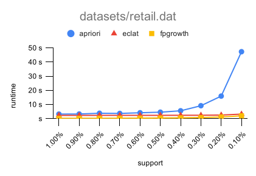
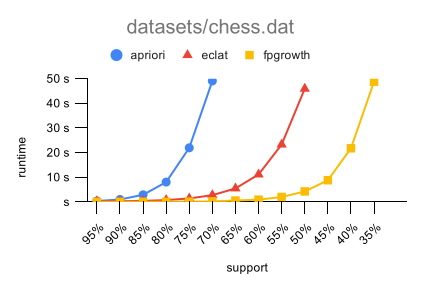

# fim

fim is a collection of some popular [frequent itemset mining](https://en.wikipedia.org/wiki/Frequent_pattern_discovery)
algorithms implemented in Go.

fim contains the implementations of the following algorithms:

* *apriori*: Based on [Fast Algorithms for Mining Associations Rules](https://dl.acm.org/doi/10.5555/645920.672836). As
  an optimization, the approach to determine the support of the candidates with a hash-tree and a transaction bitmap was
  replaced with an approach based on a [trie](https://en.wikipedia.org/wiki/Trie). As a further optimization, the
  generation of candidates of length 2 is omitted in favor of counting each occurring item pair in a 2D map.
* *eclat*: As described in [Scalable Algorithms for Association Mining](https://dl.acm.org/doi/10.1109/69.846291). The
  paper describes and analyses several approaches. The *eclat* algorithm is implemented based on the approach named
  **Eclat**. For the determination of frequent itemsets of length 2, a 2D map is used instead of a 2D array as described
  in the paper.
* *fpgrowth*: Based
  on [Mining Frequent Patterns without Candidate Generation](https://dl.acm.org/doi/10.1145/335191.335372). Implemented
  mostly as described in the paper. The only difference is that there is no special-casing implemented for FP-trees
  that are paths.
  
## Build

Execute the following commands to build the fim tool:

    git clone https://github.com/paulfedorow/fim.git
    cd fim
    make

## Usage

To see which arguments fim supports execute the following command:

    build/fim -h

The following example finds all frequent itemsets with a minimal support of 1% in the dataset contained
in `datasets/retail.dat`:

    build/fim -a fpgrowth -i datasets/retail.dat -s 0.01 

## Performance

To determine which algorithm is the most efficient, the runtime of each algorithm was measured with different datasets
and decreasing minimal support. The datasets that were used are `retail.dat` and `chess.dat`
from [FIMI Dataset Repository](http://fimi.uantwerpen.be/data/). The datasets are respectively sparse and dense. The
results are shown below. The algorithm *fpgrowth* is best in terms of runtime.

